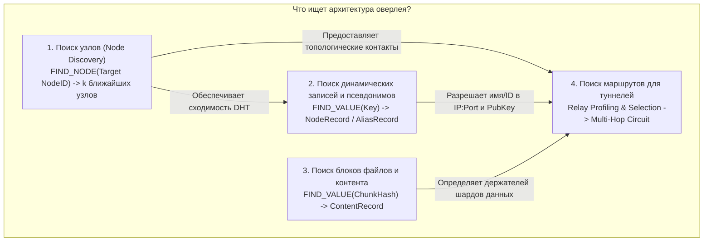
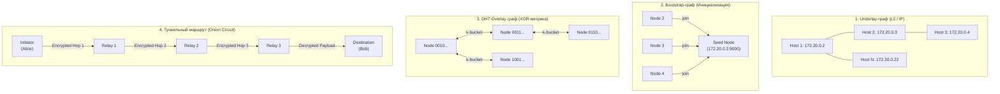
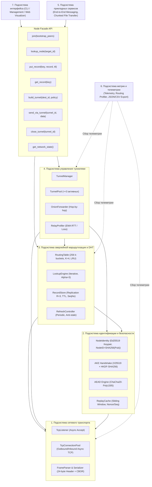
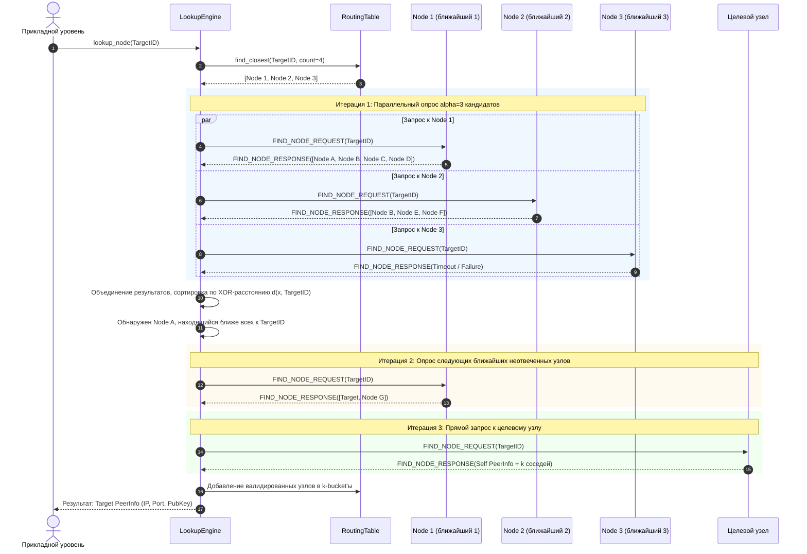
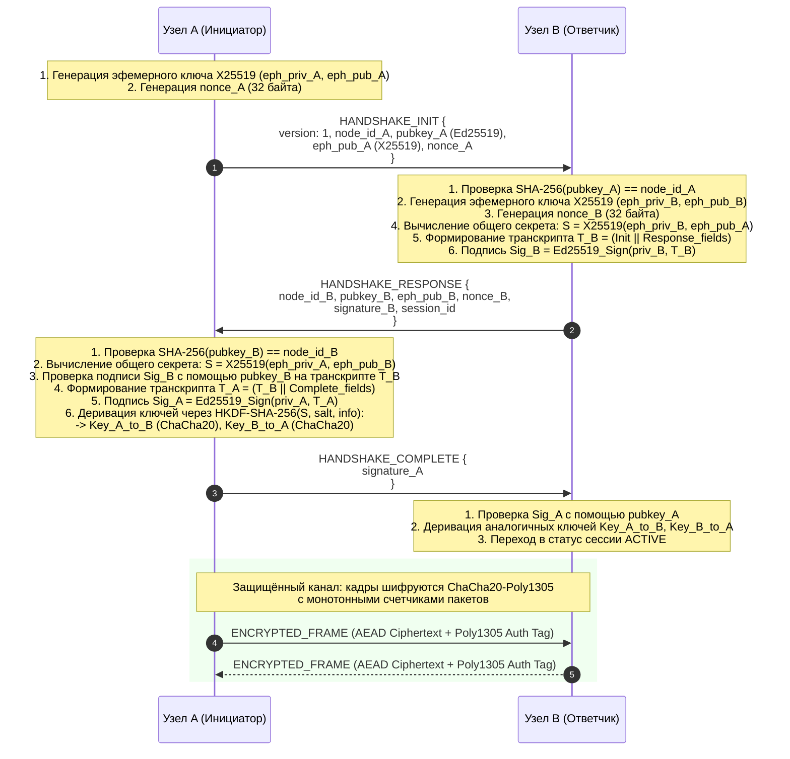
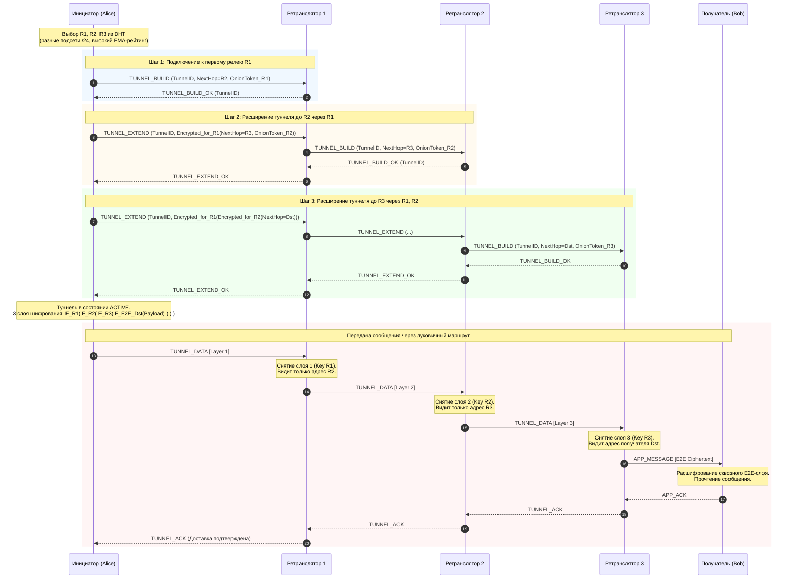
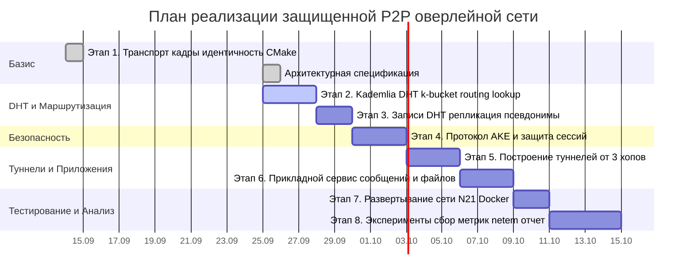

# Архитектура защищённой P2P оверлейной сети

**Версия документа**: 1.0.0  
**Статус**: Утверждённая архитектурная спецификация  
**Проект**: Защищённая децентрализованная оверлейная сеть на базе P2P-протоколов (Курсовая работа, 4 курс)  
**Уровень реализации**: Продвинутый ($N = 20\text{--}21$ узлов, $k = 4$, $\alpha = 3$, собственный AKE, $\ge 3$ ретранслятора, передача файлов, профилирование ретрансляторов)

---

## 1. Назначение системы и архитектурные процессы поиска

### 1.1. Что ищет архитектура оверлейной сети?

В децентрализованной P2P-сети отсутствует центральный сервер каталогов или реестр соответствия имён. Для организации защищённого взаимодействия между узлами архитектура решает **четыре фундаментальные задачи поиска и маршрутизации**:



1. **Поиск узлов по идентификатору (`Node Discovery` через `FIND_NODE`)**:
   - **Цель**: По заданному 256-битному `Target NodeID` найти $k$ топологически ближайших (в метрике XOR: $d(x,y) = x \oplus y$) активных узлов сети вместе с их сетевыми адресами (`IP:port`) и открытыми ключами Ed25519.
   - **Алгоритмическая сложность**: Итеративный параллельный поиск с параметром $\alpha = 3$ сходится за $O(\log N)$ шагов без полного знания топологии сети.
   - **Роль**: Формирует и актуализирует локальную таблицу маршрутизации ($256$ $k$-bucket'ов), позволяя узлу обнаруживать любых участников сети.

2. **Поиск криптографических записей адресации и псевдонимов (`FIND_VALUE` / `NodeRecord`)**:
   - **Цель**: По хэш-ключу записи найти и валидировать актуальный сетевой профиль узла или псевдонима:
     - Ключ узла: $Key = \text{SHA-256}(\text{"node:"} \parallel NodeID)$
     - Ключ псевдонима (alias): $Key = \text{SHA-256}(\text{"alias:"} \parallel \text{normalize}(alias))$
   - **Верификация**: Каждая запись подписана долговременным ключом Ed25519 владельца, имеет временную метку `issued_at`, срок действия `expires_at` (TTL) и монотонно возрастающий `sequence_number` (защита от replay и отката версий).
   - **Репликация**: Записи дублируются на $R = 3$ ближайших к ключу узлах.

3. **Поиск контента и блоков распределённых файлов (`FIND_VALUE` / `ContentRecord`)**:
   - **Цель**: Поиск узлов-хранителей блоков файлов по их криптографическому хэшу $\text{SHA-256}(ChunkBytes)$.
   - **Роль**: Обеспечивает децентрализованную передачу файлов между узлами, позволяя получателю запрашивать блоки у независимых участников оверлея.

4. **Поиск и оптимизация туннельных маршрутов (Relay Path Discovery)**:
   - **Цель**: Поиск последовательности из не менее чем $\ge 3$ независимых узлов-ретрансляторов для построения защищённого многозвенного туннеля (onion circuit).
   - **Критерии поиска ретрансляторов**:
     - Исключение повторов и циклов;
     - Разнообразие подсетей (IP/subnet diversity) для предотвращения компрометации туннеля одним провайдером/хостом;
     - Профилирование узлов: фильтрация по скользящему среднему (EMA) доступности и задержки (RTT);
     - Ротация ретрансляторов при отказах.

---

## 2. Разграничение четырёх графов сети

В соответствии с требованиями ТЗ (§4), в архитектуре строго разделены и не подменяют друг друга 4 независимых графа:



| Характеристика | 1. Underlay-сеть | 2. Bootstrap-граф | 3. DHT-Overlay | 4. Туннельный маршрут |
|---|---|---|---|---|
| **Уровень** | Сетевой L3 (IP/TCP) | Процедурный (Join) | Логический оверлей (DHT) | Прикладной сквозной (Circuit) |
| **Узлы (вершины)** | IP-адреса и порты процессов | Адреса известных seed-узлов | $NodeID \in \{0,1\}^{256}$ | Инициатор, ретрансляторы, адресат |
| **Рёбра (связи)** | Физическая IP-достижимость | Первичные TCP-соединения | Контакты в $k$-bucket'ах | Согласованные сессии туннеля |
| **Метрика расстояния** | Сетевая задержка (RTT) | Статический список конфига | Метрика XOR: $d(x,y) = x \oplus y$ | Количество хопов ($\ge 3$ релея) |
| **Жизненный цикл** | Постоянный (инфраструктура) | Кратковременный (при старте) | Динамический (LRU, ping, refresh) | Временный (TTL туннеля, pool) |

> [!IMPORTANT]
> **Принципиальное различие**: Путь DHT-поиска (`FIND_NODE` / `FIND_VALUE`) **не является туннелем**. Туннель — это заранее построенный и подтверждённый криптографический виртуальный канал с луковичным шифрованием (Onion Routing) через выделенные узлы-ретрансляторы.

---

## 3. Общая компонентная архитектура узла

Каждый узел сети представляет собой автономную систему, состоящую из 7 логически изолированных подсистем (ТЗ §7), взаимодействующих через строгий фасад (`NodeFacade`):



---

## 4. Описание подсистем

### 4.1. Подсистема сетевого транспорта (Transport Subsystem)
- **Назначение**: Обеспечение надёжного асинхронного обмена кадрами по протоколу TCP без блокировок (на базе `boost::asio` / `asio standalone`).
- **Кадрирование**:
  - Бинарный заголовок фиксированного размера (24 байта): `version` (1B), `type` (1B), `flags` (2B), `request_id` (16B UUID/uint128), `payload_length` (4B).
  - Потоковый парсер `FrameParser` со скользящим буфером: корректная обработка фрагментации TCP, склейки кадров, частичных заголовков.
  - Жёсткий лимит `MAX_FRAME_PAYLOAD = 65 536` байт с предварительной валидацией до выделения памяти.
- **Сериализация**: Компактный двоичный формат CBOR (RFC 8949) через `nlohmann::json::to_cbor` / `from_cbor`.

### 4.2. Подсистема идентификации и безопасности (Identity & Security)
- **Долговременная идентичность**:
  - Пара ключей Ed25519 (генерация, безопасное хранение в файле состояния узла).
  - Детерминированный идентификатор узла:
    $$\text{NodeID} = \text{SHA-256}(\text{identity\_public\_key})$$
  - Запрет случайной смены `NodeID`; приём любого контакта сопровождается проверкой соответствия $\text{SHA-256}(pubkey) \stackrel{?}{=} NodeID$.
- **Учебный криптографический протокол AKE (Authenticated Key Exchange)**:
  - Эфемерный обмен Диффи-Хеллмана на кривой Curve25519 (X25519);
  - Взаимная аутентификация: подпись транскрипта рукопожатия ключами Ed25519;
  - Деривация сессионных ключей: HKDF-SHA-256 с раздельными ключами для направлений `A->B` и `B->A`;
  - Симметричное шифрование кадров: ChaCha20-Poly1305 (AEAD) с контролем монотонности счетчиков (защита от replay в сессии и между сессиями).

### 4.3. Подсистема оверлейной маршрутизации и DHT (DHT & Discovery)
- **Таблица маршрутизации (`RoutingTable`)**:
  - 256 списков $k$-bucket'ов для каждого бита XOR-расстояния;
  - Параметр $k = 4$ (для продвинутого уровня $N = 20\text{--}21$);
  - LRU-вытеснение: при заполнении бакета старейший контакт проверяется пингом (`PING`), заменяется только при отсутствии ответа.
- **Итеративный поиск (`LookupEngine`)**:
  - Параметр параллелизма $\alpha = 3$;
  - Параллельная отправка RPC `FIND_NODE` к 3 ближайшим известным узлам;
  - Динамическое обновление списка ближайших кандидатов, исключение дубликатов;
  - Остановка при отсутствии прогресса (новые контакты дальше текущих ближайших $k$).
- **Хранилище записей (`RecordStore`)**:
  - Подписанные записи `NodeRecord` и `ContentRecord`;
  - Репликация на $R = 3$ ближайших узла; подтверждение записи при успехе на $\ge 2$ узлах;
  - Контроль времени жизни (TTL = 120–300 с) и фоновое переопубликование каждые $\text{TTL}/2$.

### 4.4. Подсистема управления туннелями (Tunnel Management)
- **Архитектура луковичного канала**:
  - Построение цепочки через $\ge 3$ промежуточных узла: $\text{Src} \to R_1 \to R_2 \to R_3 \to \text{Dst}$.
  - Инициатор генерирует независимые сессионные симметричные ключи $K_1, K_2, K_3$ для каждого релея.
  - Пакет данных оборачивается слоями шифрования:
    $$\text{Layer}_1 = E_{K_1}(R_2 \parallel E_{K_2}(R_3 \parallel E_{K_3}(\text{Dst} \parallel \text{Payload})))$$
  - Каждый релей снимает свой слой и узнает адрес только следующего звена (forward secrecy hop-by-hop).
- **Пул туннелей (`TunnelPool`)**:
  - Поддержание не менее 3 активных/подготовленных туннелей;
  - Быстрое переключение при деградации или разрыве активного канала.
- **Профилирование ретрансляторов (`RelayProfiler`)**:
  - Расчёт экспоненциального скользящего среднего (EMA):
    $$\text{EMA}_{\text{RTT}} = (1 - \beta) \cdot \text{EMA}_{\text{prev}} + \beta \cdot \text{RTT}_{\text{sample}}$$
    $$\text{EMA}_{\text{success}} = (1 - \beta) \cdot \text{EMA}_{\text{prev}} + \beta \cdot (1 \text{ при успехе, } 0 \text{ при ошибке})$$
  - Исключение узлов из одной /24 подсети для обеспечения IP/subnet diversity.

### 4.5. Подсистема прикладных сервисов (Application Services)
- **Защищённый обмен сообщениями (End-to-End Encrypted Messaging)**:
  - Сквозное шифрование полезной нагрузки между отправителем и получателем (даже конечный ретранслятор $R_3$ не видит открытый текст);
  - Гарантированная доставка с квитированием `APP_ACK`.
- **Блочная передача файлов (Chunked File Transfer)**:
  - Разбиение файлов на блоки фиксированного размера 48–60 КиБ (гарантированное укладывание в `MAX_FRAME_PAYLOAD = 65 536` байт с учетом заголовков и AEAD-тегов);
  - Контроль целостности блоков и файла по хэшу SHA-256;
  - Скользящее окно передачи и восстановление пропущенных блоков.

### 4.6. Подсистема метрик и телеметрии (Metrics & Experimentation)
- Логирование каждого поискового запроса: `lookup_id`, число итераций, число отправленных RPC, задержка поиска, процент успешности.
- Мониторинг наполняемости $k$-bucket'ов для подтверждения невырожденности DHT.
- Экспорт телеметрии в машиночитаемые форматы JSON и CSV для построения графиков в отчете.

### 4.7. Подсистема интерфейса управления (User Interface & Node Facade)
- CLI-интерфейс для интерактивного управления узлом:
  - `lookup <node_id | alias>`
  - `send <dest_id> <message>`
  - `send-file <dest_id> <file_path>`
  - `show-dht`
  - `show-tunnels`
- Фасадный программный API для изоляции прикладного слоя от внутренней структуры таблиц маршрутизации.

---

## 5. Детальные диаграммы взаимодействия

### 5.1. Итеративный алгоритм DHT Lookup ($\alpha = 3$, $k = 4$)

Диаграмма иллюстрирует процесс поиска узла $TargetID$ в Kademlia DHT:



---

### 5.2. Учебный криптографический протокол AKE (Handshake)

Диаграмма установления защищённой сессии между двумя узлами без использования TLS:



---

### 5.3. Построение 3-звенного туннеля и луковичная передача

Диаграмма иллюстрирует процесс создания луковичного маршрута через 3 ретранслятора и доставку зашифрованного сообщения:



---

## 6. Критерии невырожденности DHT (ТЗ §6)

В курсовой работе критически важно доказать работоспособность алгоритмов Kademlia и отсутствие скрытых упрощений. В соответствии с разделом 6 ТЗ, реализация строго удовлетворяет **шести критериям невырожденности**:

| № | Критерий ТЗ | Архитектурная реализация в проекте | Способ верификации в эксперименте |
|---|---|---|---|
| **1** | Запрет глобального реестра адресов | Узел хранит только свои $k$-bucket'ы. В коде отсутствует глобальная статическая мапа `NodeID -> Address`. | Инспекция памяти и кода; запуск узлов в изолированных контейнерах с разными томами. |
| **2** | Неполное знание сети ($\ge 80\%$ узлов знают $< N - 1$ контактов) | При $N = 21$ и $k = 4$, ёмкость бакетов ограничена, таблица содержит не более $12\text{--}15$ контактов. | Сбор метрики `routing_table_size` со всех узлов после завершения этапа bootstrap. |
| **3** | $\ge 30$ многошаговых контрольных поисков | Контрольный тест генерирует 30 пар $(S_i, D_i)$, где $D_i \notin \text{RoutingTable}(S_i)$ на момент старта. | Лог поиска фиксирует отсутствие $D_i$ в локальной таблице перед запуском `lookup_node()`. |
| **4** | Наличие промежуточных хопов | Каждый контрольный поиск обращается минимум к 1 промежуточному DHT-узлу (число RPC $\ge 2$, итераций $\ge 2$). | Журналирование трассы: список опрошенных узлов по итерациям с отметкой каждого хопа. |
| **5** | Живучесть при падении bootstrap-узла | После стабилизации сети $N = 21$ узел seed-bootstrap отключается (`SIGKILL`/`docker stop`). Сеть сохраняет связность. | Успешное выполнение `FIND_NODE` и `FIND_VALUE` между оставшимися 20 узлами после смерти bootstrap. |
| **6** | Полная фиксация телеметрии | Автоматический сбор и экспорт в CSV/JSON метрик заполнения бакетов, RTT, числа итераций и RPC. | Генерация артефактов `results/lookup_metrics.json` и `results/bucket_distribution.csv`. |

---

## 7. Модель угроз и механизмы защиты (Security Architecture)

### 7.1. Модель нарушителя
- **Внутренний пассивный нарушитель**: Узел-ретранслятор пытается анализировать проходящий трафик.
  - *Защита*: Луковичное шифрование промежуточных слоев и сквозное (End-to-End) шифрование полезной нагрузки. Релей $R_i$ знает только $R_{i-1}$ и $R_{i+1}$.
- **Активный нарушитель (MITM / Tampering)**: Попытка подмены сообщений на уровне TCP.
  - *Защита*: Аутентифицированное шифрование ChaCha20-Poly1305 каждого кадра; несовпадение тега аутентификации приводит к мгновенному разрыву сессии.
- **Replay-атаки**: Повторная отправка перехваченного валидного кадра в текущей или новой сессии.
  - *Защита*: Монотонные 64-битные счётчики пакетов внутри сессии + привязка к уникальному эфемерному `session_id`.
- **Подмена записей DHT / Откат версий (Rollback)**: Публикация устаревшей записи адреса жертвы.
  - *Защита*: Подпись записей ключом Ed25519 владельца; валидация монотонности `sequence_number` (записи со старым или равным номером отклоняются как атака).
- **Sybil и Eclipse атаки**: Попытка злоумышленника захватить окрестность определенного `NodeID`.
  - *Защита*:
    - Детерминированная привязка $NodeID = \text{SHA-256}(PubKey)$, делающая невозможной генерацию произвольного ID без подбора ключа;
    - Ограничение количества узлов из одной IP-подсети (/24) в одном $k$-bucket'е (IP/subnet diversity);
    - Независимые пути поиска ($\alpha = 3$).

---

## 8. Программные интерфейсы узла (Facade API)

В соответствии с требованиями ТЗ (§7), прикладной слой взаимодействует с оверлеем исключительно через класс-фасад:

```cpp
namespace p2p {

class NodeFacade {
public:
    virtual ~NodeFacade() = default;

    // Присоединение к сети через известные bootstrap-узлы
    virtual bool join(const std::vector<PeerAddress>& bootstrap_peers) = 0;

    // Итеративный поиск узла в Kademlia DHT
    virtual std::optional<PeerInfo> lookup_node(const NodeID& target_node_id) = 0;

    // Публикация подписанной записи в DHT (репликация на R=3 узла)
    virtual bool put_record(const std::string& key, 
                            const std::vector<uint8_t>& data, 
                            std::chrono::seconds ttl) = 0;

    // Поиск записи в DHT
    virtual std::optional<std::vector<uint8_t>> get_record(const std::string& key) = 0;

    // Построение луковичного туннеля через >= 3 ретранслятора
    virtual std::optional<uint32_t> build_tunnel(const NodeID& destination_node_id, 
                                                 const TunnelConstraints& constraints) = 0;

    // Отправка защищенных данных через активный туннель
    virtual bool send_via_tunnel(uint32_t tunnel_id, 
                                 const std::vector<uint8_t>& payload) = 0;

    // Закрытие туннеля и освобождение ресурсов
    virtual bool close_tunnel(uint32_t tunnel_id) = 0;

    // Получение текущего состояния сети и метрик
    virtual NetworkState get_network_state() const = 0;
};

} // namespace p2p
```

---

## 9. Дорожная карта реализации (Этапы разработки)



| Этап | Название | Ключевые компоненты | Статус |
|---|---|---|:---:|
| **Этап 1** | Сетевой транспорт, кадры и идентичность | TCP-соединения, кадрирование 24B, FrameParser, Ed25519, NodeID, TOML-конфиг | **Выполнен** |
| **Документация** | Архитектурная спецификация | 7 подсистем, 4 графа, процессы поиска, AKE, луковичные туннели, фасад API | **Выполнен** |
| **Этап 2** | Kademlia DHT | KBucket LRU, RoutingTable 256, итеративный lookup $\alpha=3$, $k=4$, сетевой bootstrap, тесты E2-1..E2-8 | **В разработке** |
| **Этап 3** | Записи DHT и псевдонимы | `STORE`, `FIND_VALUE`, NodeRecord, репликация $R=3$, TTL, алиасы | Запланирован |
| **Этап 4** | Собственный AKE и защита сессий | Curve25519 (X25519), HKDF-SHA256, ChaCha20-Poly1305, replay-кэш | Запланирован |
| **Этап 5** | Многопереходные туннели ($\ge 3$ хопа) | Onion routing, пул $\ge 3$ туннелей, профилирование ретрансляторов (EMA) | Запланирован |
| **Этап 6** | Прикладные сервисы | Защищенные E2E сообщения, блочная передача файлов с SHA-256 | Запланирован |
| **Этап 7** | Развёртывание сети ($N = 21$) | Docker Compose, 4 схемы bootstrap (star, ring, tree, multi-seed) | Запланирован |
| **Этап 8** | Эксперименты и отчёт | Netem (задержки, потери), отказ узлов, экспорт CSV/JSON, графики | Запланирован |

